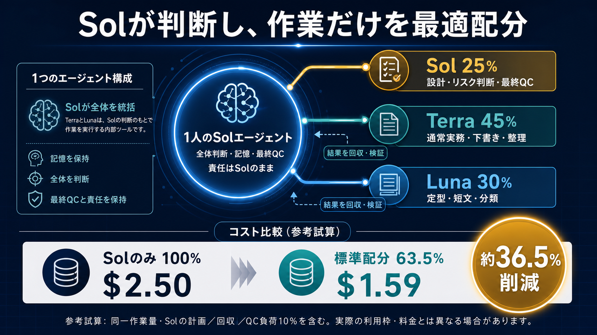

# OpenClaw Model Router MCP

[English](./README.md)

OpenClaw上でSol・Terra・Lunaへのタスク配分を計画し、運用者が明示的に有効化した場合だけ限定的に実行するMCPサーバーです。全体判断・記憶・結果回収・最終QC・責任はSolが保持します。

`0.4.0-rc.11`は公開RC（リリース候補版）です。実行機能は初期状態で無効です。



## できること

- **Sol**：設計、リスク判断、文脈・記憶、結果回収、最終QC、責任を担当します。
- **Terra**：通常実務、下書き、情報整理を担当する想定です。
- **Luna**：定型処理、短文、分類を担当する想定です。
- TerraとLunaの結果はSolへ戻され、Solが検証します。最終回答を独立して確定する構成ではありません。
- サーバー側の安全ゲートは、Sol維持または承認要求へ厳しくできますが、運用者のポリシーを弱めることはできません。

図解の標準配分は **Sol 25% / Terra 45% / Luna 30%** です。図解記載の前提に基づく参考試算では、Sol単独100%に対して **63.5%相当、約36.5%削減**です。これは説明用の試算であり、料金・利用枠・削減効果の保証ではありません。実際の提供状況、利用枠、token消費、料金は異なる場合があります。

この配分と削減試算は、運用者が実行機能を**明示的に有効化した場合の想定**です。初期状態では`execute_task`が非公開かつ無効なので、installしただけでこの配分や削減が実現するわけではありません。

## 安全設計と認証経路

- OpenClaw Gatewayの既存Codex認証だけを使います。
- packageはprovider credentialを受け取らず、provider HTTP endpointへ直接送信しません。
- 別transport・別modelへのfallbackは禁止です。

adapterは`openclaw agent`をGateway経由で実行し、次をすべて検証します。

- 指定したSol・Terra・Lunaのprovider/modelと一致すること
- `agentHarnessId=codex`かつ`authMode=auth-profile`であること
- model fallbackが使われていないこと
- 専用agentのtoolが`sessions_yield`以外に存在しないこと
- OpenClawが実測token usageを返していること

1つでも確認できなければfail closed（安全側で停止）します。代替provider経路はありません。

## 必須条件

- Node.js 20以上
- OpenClaw `2026.6.10`以上
- Codex認証が正常なこと
- `sessions_yield`以外のtoolを持たない専用OpenClaw agent。OpenClaw 2026.6.10ではread-only core toolが自動露出するため、`tools.deny=["session_status"]`を明示設定
- `MODEL_ROUTER_OPENCLAW_AGENT`に専用agent idを設定
- このpackage用のprovider credentialは不要

## インストール

```bash
npm install -g openclaw-model-router-mcp@next
```

global installせずに実行する場合：

```bash
npx openclaw-model-router-mcp@next
```

## ローカルチェックとCLI

```bash
npm run check
npm test
openclaw-model-router-cli estimate "安全な実装計画を作る"
MODEL_ROUTER_OPENCLAW_AGENT=model-router openclaw-model-router-cli plan "安全な実装計画を作る"
```

`estimate_task`はmodelを呼ばない決定論的な参考判定です。`plan_task`はOpenClaw経由でSol planningだけを行い、計画したsubtaskを実行しません。`execute_task`は初期状態で非公開かつ無効で、client入力から有効化できません。

## 利用量と参考金額

実行modelとtoken usageの正本はOpenClawです。USD表示は設定上の参考推定と明記し、providerの実測請求額として表示しません。

routing fieldと`openclaw agent`へ渡すmodel IDは、OpenClaw model catalogに登録された`openai/gpt-5.6-*`を使用します。返却metadataではCodex harnessとOpenClaw auth profileを必須検証し、API provider直呼びやAPI key fallbackには切り替えません。

## 公開状態

RC版のためnpmでは`next` dist-tagを使います。実行を有効化する前に、安全設計を確認し、隔離した専用OpenClaw agentでテストしてください。
