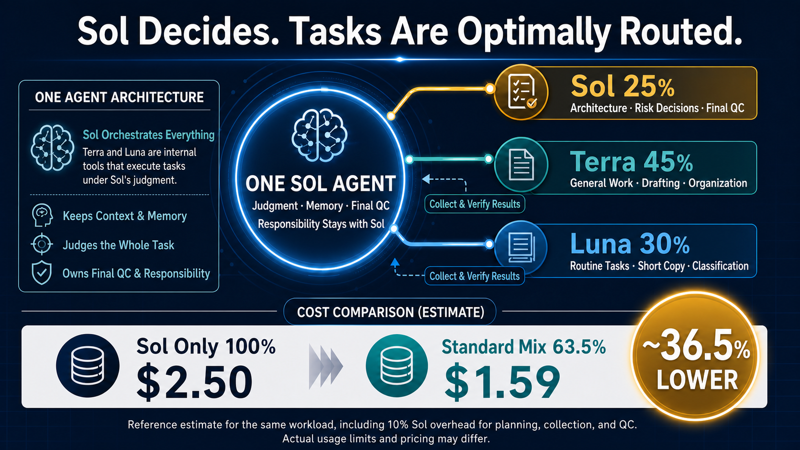

# OpenClaw Model Router MCP

[日本語](./README.ja.md)

An OpenClaw-native MCP server that plans and, when explicitly enabled by the operator, executes bounded task routing across Sol, Terra, and Luna while keeping final judgment, memory, verification, and responsibility with Sol.

Version `0.4.0-rc.11` is a public release candidate. Execution remains disabled by default.



## What it does

- **Sol** owns architecture, risk decisions, context, memory, result collection, final QC, and responsibility.
- **Terra** is intended for general work, drafting, and organization.
- **Luna** is intended for routine tasks, short copy, and classification.
- Terra and Luna results return to Sol for verification; they do not independently own the final answer.
- Server-side safety gates may keep work on Sol or require approval, but cannot weaken the policy chosen by the operator.

The reference workload mix shown above is **Sol 25% / Terra 45% / Luna 30%**. Under the diagram's stated assumptions, that mix is estimated at **63.5% of the Sol-only reference cost**, or approximately **36.5% lower**. This is an illustrative estimate, not a pricing or usage-limit guarantee. Actual availability, limits, token use, and pricing may differ.

The allocation and savings estimate describe the intended execution mode **only when the operator explicitly enables execution**. With the default configuration, `execute_task` is hidden and disabled, so installing the package alone does not produce that allocation or savings.

## Safety and authentication model

The router uses the OpenClaw Gateway's existing Codex auth profile. It never accepts provider credentials, never sends provider HTTP requests itself, and never falls back to another transport.

The adapter invokes `openclaw agent` through the running Gateway and verifies all of the following before accepting output:

- provider/model match the requested Sol, Terra, or Luna model;
- `agentHarnessId=codex` and `authMode=auth-profile`;
- no model fallback was used;
- the dedicated agent tool policy contains no tool other than `sessions_yield`;
- OpenClaw returned measured token usage.

If any check fails, the router stops. There is no alternate provider path.

## Requirements

- Node.js 20 or newer.
- OpenClaw `2026.6.10` or newer with working Codex authentication.
- A dedicated OpenClaw agent with only the harmless `sessions_yield` tool available. On OpenClaw 2026.6.10, explicitly set `tools.deny=["session_status"]` because the read-only core tool is otherwise auto-exposed.
- `MODEL_ROUTER_OPENCLAW_AGENT` set to that agent id.
- No provider credential is required by this package.

## Install

```bash
npm install -g openclaw-model-router-mcp@next
```

Or run it without a global install:

```bash
npx openclaw-model-router-mcp@next
```

## Local checks and CLI

```bash
npm run check
npm test
openclaw-model-router-cli estimate "Draft a safe implementation plan"
MODEL_ROUTER_OPENCLAW_AGENT=model-router openclaw-model-router-cli plan "Draft a safe implementation plan"
```

`estimate_task` is deterministic and does not invoke a model. `plan_task` invokes Sol through OpenClaw but never executes planned subtasks. `execute_task` remains hidden and disabled by default; a client request cannot enable it.

## Usage and accounting

OpenClaw is the source of truth for the executed model and token usage. USD fields are explicitly labeled configured reference estimates and are never presented as invoices or actual billing.

The routing fields and the model IDs passed to `openclaw agent` use the configured OpenClaw model IDs `openai/gpt-5.6-*`. The adapter still requires the Codex harness and an OpenClaw auth profile in the returned runtime metadata; it never falls back to a direct provider call or API key.

## Release status

This package uses the npm `next` dist-tag because it is a release candidate. Review the safety model and test it in an isolated OpenClaw agent before enabling execution.
